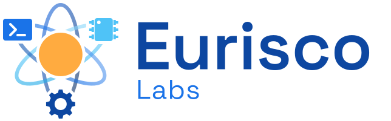

We design, build, and ship products at the intersection of software, hardware, and engineering — documented openly.

## What we believe

- **Build openly** Every project is documented from first sketch to final product — process, mistakes, and all.
- **Research first** We start with the science. Open lab notebooks, preprints, and accessible explanations.
- **Made to last** Functional, durable, repairable. No planned obsolescence, no dark patterns.

## Current Projects
- [Smart Filament Box](projects/filament-spool-holder/index.md)

See [all projects](projects/index.md).

## What we're working on

- [Education](education/index.md) Learning techniques and educational games.
- [Electronics](electronics/index.md) Cyberdeck, EV battery experiments, and small hardware builds.
- [Engineering](engineering/index.md) Reference library of mechanical joints and design fundamentals.
- [Food](food/index.md) — Recipes and food processing — high protein, sugar-free, homemade.
- [Health](health/index.md) — Light therapy hardware and wellbeing experiments.
- [Kitchen Garden](projects/kitchen-garden/index.md) — Growing food from seed — onions, tomatoes, herbs.
- [Lidar Bot](projects/lidar-bot/index.md) — An autonomous vacuum and mop robot, phase by phase.
- [Manufacturing](manufacturing/index.md) — 3D printing research, calibration knowledge, and automation projects.
- [Software](software/index.md) — Tools, experiments, and notes on how software gets made.
- [Workshop](workshop/index.md) — The modular storage system and shop infrastructure.
